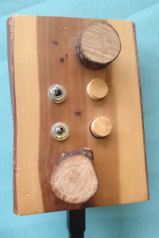
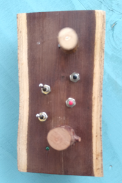

**Using the Intelligent Instrument's Lab's two mLogs to Tidal**

Usage
=====
1) Identify your iLog

This is the Yew mLog:

This is the Laburnam mLog:

2) The repositary already has the correct config files for these two mLogs so open a terminal and navigate to the serialToOSC directory and choose the appropriate command below.

  $ python3 serial2OSC --config ILL-yew-tidal.json
  $ python3 serial2OSC --config ILL-laburnam-tidal.json

  If it starts then you should see the an address printed out i.e. 127.0.0.1

  Errors like:

  FileNotFoundError: [Errno 2] No such file or directory: '/dev/cu.usbmodem109618201'

  Mean you not plugged the mLog, it's broken or you are trying to access the wrong mLog.

  3) It's all good then head to Tidal!

  **Tidal**
  Tidal and serialToOSC manage everything for you in the back ground.  To access the data you use a command float (cF) and the name of the data you want to access.  This is like Midi and discussed here (add link to OSC Tidal page).

  e.g.
      d1 $ sound "bev*4" # speed ("2" * cF 1 "analog-2") # legato 1

  Loads the sample "bev" then links the speed of the sample to 2 * "the control input called analog-2"

  e.g.
      d1 $ s " bd hh bd hh*2"
        # lpf ("500 500 500" * ( "0.1" +  cF 1 "analog-1"))
        # lpq ("0.02" + "0.8" * cF 1 "analog-3")

Controls a low pass filter with analog-1 - note the **"0.1" + cF...** bit, the mLog sends float data from 0 to 1.0 so the low pass ffequency in effect goes between 500x0.1 and 500x1.1..

e.g.
      d1 $ s "Superhoover" # slide ("1 1 -1") # accelerate 1
        # lpf ("500" + "2000" * cF 1 "analog-1")
        # lpq ("0.02" + "0.8" * cF 1 "analog-3")
        # gain (cF 1 "digital-1")

**mLog data and data names**
The mLog data is normalised between 0. and 1.0.  Both mLogs have an accelerometer inside this has Pitch and Roll (like a boat).

Control on mLog       name in tidal

  Pitch                   analog-1
  Roll                    analog-2
  Knob 1                  analog-3
  Knob 2                  analog-4

  Buttons and switches.
  Button                  digital-1 ..... 4 (the Laburnam log has 4 more buttons on the back)

  You can use the switch and the gain control to mute synths.
